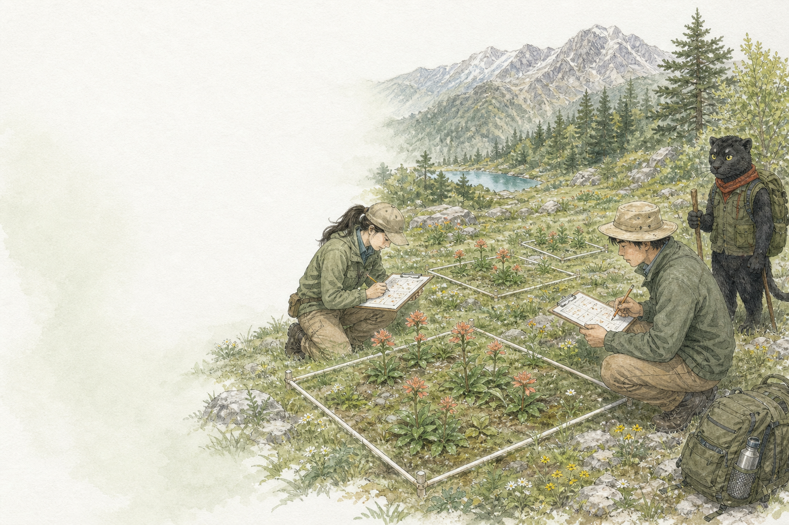

:::: {.chapter-cover}
::: {.chapter-cover-media}

:::

::: {.chapter-cover-copy}
第一篇 · 从保护问题进入统计

<h1>第 1 章 统计学在保护中的角色</h1>

从“我感觉花少了”，走向“我们有多强的证据”。

:::

::: {.chapter-cover-foot}
[开始本章 →](01-role-of-statistics.qmd){.chapter-cover-enter}

观察现象 · 识别不确定性 · 形成证据 · 支持行动
:::
::::
