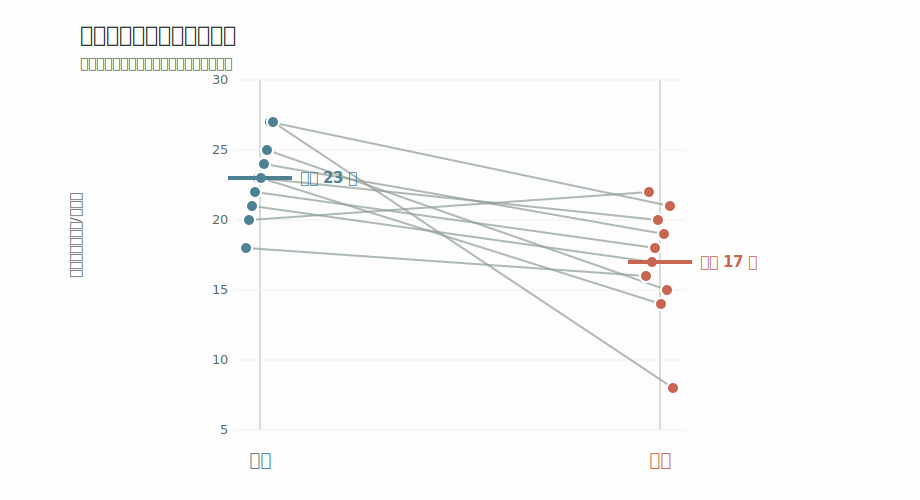

```{=html}
<div class="ch1-fig sketch">
  <div class="ch1-section">
    <div class="ch1-section-h">① 保护数据中的不确定性</div>
    <div class="ch1-noise-row">
      
      <div class="ch1-noises">
        <span class="tag">自然变异</span>
        <span class="tag">观察误差</span>
        <span class="tag">时间波动</span>
        <span class="tag">样本有限</span>
        <span class="tag">偶然性</span>
      </div>
    </div>
  </div>

  <div class="ch1-divider"><span class="arrow">↓</span></div>

  <div class="ch1-section">
    <div class="ch1-section-h">② 统计学在保护中的四个作用</div>
    <div class="ch1-pipeline-row">
      
      <div class="ch1-pipeline">
        <div class="ch1-step s1">
          <div class="num">1</div>
          <div class="name">描述</div>
          <div class="q">现在是<br>什么状态？</div>
        </div>
        <span class="ch1-step-arrow">→</span>
        <div class="ch1-step s2">
          <div class="num">2</div>
          <div class="name">比较</div>
          <div class="q">不同对象<br>有差异吗？</div>
        </div>
        <span class="ch1-step-arrow">→</span>
        <div class="ch1-step s3">
          <div class="num">3</div>
          <div class="name">推断</div>
          <div class="q">差异<br>可信吗？</div>
        </div>
        <span class="ch1-step-arrow">→</span>
        <div class="ch1-step s4">
          <div class="num">4</div>
          <div class="name">支持行动</div>
          <div class="q">下一步<br>怎么做？</div>
        </div>
      </div>
    </div>
  </div>

  <div class="ch1-divider"><span class="arrow">↓</span></div>

  <div class="ch1-final-row">
    
    <div class="ch1-final">🛡️ 保护决策</div>
  </div>

  <div class="ch1-caveat">
    <b>黑豹提醒：</b>显著 ≠ 重要 ｜ 不显著 ≠ 没效果 ｜ 证据 ≠ 决策<br>
    统计回答“证据有多强”，保护决策还要回答“行动是否值得”。
  </div>
</div>
```

## 1.1 为什么保护工作需要统计学

<div class="chapter-route" aria-label="本节学习路线">
  <div><strong>观察现象</strong><span>23 株降到 17 株</span></div>
  <div><strong>识别不确定性</strong><span>过程、抽样与检测</span></div>
  <div><strong>描述与估计</strong><span>变化有多大</span></div>
  <div><strong>推断与预测</strong><span>证据能走多远</span></div>
  <div><strong>支持行动</strong><span>证据不是决策</span></div>
</div>

::: {.learning-goals}
**学完本章后，你能够：**

1. 区分“样地中的开花个体减少”与“整个种群正在下降”两种结论。
2. 识别自然过程、抽样、测量与检测带来的不确定性。
3. 解释描述、估计、比较、推断和预测如何形成保护证据链。
4. 评价统计证据与保护行动之间的关系。
:::

## 从一个真实问题开始

某自然保护区连续两年监测一种濒危草本植物。工作人员在固定样地中记录开花个体数量：去年 10 个样地平均每样地 23 株开花，今年同样的样地、同样的方法，平均只有 17 株。

保护站开会时，大家意见不一。

“今年肯定少了，”老巡护员说，“我天天在山里走，明显感觉花没去年多。”

“但我看东边那片开得挺好的，”另一位同事反驳，“说不定只是样地刚好落在了差的地方。”

“去年春天雨水多，今年偏旱，会不会只是天气波动？”新来的技术员问。

站长最后问了一个核心问题：**我们真的有证据说这个物种种群在下降吗？如果没有，我们该不该现在就改变保护措施？**

目前的数据首先说明：**这 10 个固定样地中的开花个体平均数下降了。** 它是否代表整个保护区的开花个体减少，是否进一步意味着种群数量下降，还取决于样地代表性、逐样地变化、检测过程和更长时间的监测。统计学能够帮助我们量化其中的证据，但不能独自决定结论和行动。

::: {.observation-question}
**观察问题：** 在连续两年的样地监测中，濒危草本植物的开花个体数从平均 23 株下降到 17 株。这一下降有多稳定？它能支持多大范围的结论？我们还需要哪些证据才能决定是否改变保护措施？
:::

<figure class="evidence-figure">
  
  <figcaption><strong>图 1.1：同样是“平均数从 23 降到 17”，逐样地变化提供了更多信息。</strong> 图中数据用于教学示意。固定样地应按配对方式观察，不能只比较两个孤立的均值。</figcaption>
</figure>

## 保护数据中的不确定性来源

回到开头的濒危植物监测。站长的困惑可以拆成三个层层递进的问题：

- **今年真的比去年少了吗？** 下降 6 株是稳定变化，还是某些样地的偶然波动？
- **少多少才值得关注？** 从 23 降到 22 和从 23 降到 17，在管理上可能代表完全不同的紧迫程度。
- **我们是否应该改变保护措施？** 增加人工繁育、扩大保护范围都需要成本，行动前必须判断证据是否足够。

在选择统计方法之前，先要承认一个事实：保护数据来自不断变化的自然系统，不确定性不是异常，而是研究对象的一部分。

**自然过程变异。** 同样是 50 年生的云南松，胸径可能相差很大；同一物种在不同坡位和土壤上的密度也会不同。这不是错误，而是自然界真实存在的差异。

**抽样不确定性。** 我们不可能调查保护区内的每一棵树、每一只鸟，只能通过样地、样线或样点推测整体。样本是否足够、是否具有代表性，会直接影响结论能够推广到哪里。

**测量与检测误差。** 调查员经验、天气和设备状态都会改变记录结果。红外相机没有拍到动物，不等于动物没有出现；幼苗没有被发现，也不等于样方中没有幼苗。

**时间变化。** 病虫害有大小年，植物开花受温度和降水影响，动物活动也有昼夜和季节节律。一次调查只是整个过程中的一个快照。

**模型与解释的不确定性。** 同一组数据可能符合多种解释。开花个体减少可能来自种群衰退，也可能来自当年干旱降低了开花率。统计模型能够比较这些解释，却不能凭空补上没有测量的信息。

> **没有统计，我们很容易把偶然波动误认为真实规律；没有好的研究设计，我们也可能把一个真实数字解释成错误的故事。**

## 保护工作不只是看现象，而是做判断

保护生物学中有许多需要做判断的时刻：

| 场景 | 需要判断的问题 |
|------|---------------|
| 某保护区连续多年监测鸟类 | 种群数量是否下降？下降速度有多快？ |
| 新发现一种蛀干害虫在人工林中扩散 | 扩散范围有多大？哪些林分风险更高？ |
| 一项生物防治措施已经试用两年 | 防治措施是否有效？效果有多大？ |
| 比较人工林和天然林的生物多样性 | 物种组成是否不同？差别体现在哪里？ |
| 红外相机拍到某种动物的次数增加 | 是数量增加，还是活动范围或检测条件变化？ |

这些问题具有相同的结构：**我们观察到了某种现象，但还要判断它是否真实、是否重要，以及是否需要行动。** 统计学不是把数据变复杂，而是帮助我们在不确定中做更可靠的判断。

## 统计学怎样进入保护证据链

从观测到行动，统计学并不是一张互不相干的方法清单，而是一条反复更新的证据链。我们先描述看到了什么，再估计变化有多大；随后判断样本中的模式能否推广，或预测未来可能发生什么；最后把统计证据与成本、风险和保护目标放在一起考虑。

### 描述：现在是什么状态？

拿到数据后的第一步永远是“看清楚”。描述统计回答的是：保护对象目前是什么状态？

- 某林区云南松的平均虫口密度是多少？不同样地之间差异多大？
- 某保护区今年记录到多少种鸟类？每种鸟出现的频率如何？
- 红外相机监测中，某种动物的独立拍摄次数是多少？

描述不是随便求一个平均数。数据有极端值时，中位数可能比均值更有代表性；需要表达离散程度时，标准差和四分位距提供的信息也不同。这些内容将在第 5 章详细展开。

### 估计与比较：变化有多大？

保护工作中经常需要比较两个地方、两个时间点或两种处理，但比较不应只停留在“有没有差异”。我们还要估计差异有多大、方向是否稳定，以及这个差异的不确定范围。

- 人工林和天然林中的鸟类物种数相差多少？
- 施用 A 药剂和 B 药剂后，害虫死亡率相差多少个百分点？
- 保护区建立前后，旗舰物种的出现频率发生了多大变化？

效应大小及其不确定范围，通常比单独一句“有差异”更接近保护管理真正需要的信息。

### 推断与预测：证据能走多远？

假设药效试验中，处理组的害虫死亡率是 72%，对照组是 58%，相差 14 个百分点。这个差异是药剂作用的信号，还是样本波动也可能造成的结果？

在“处理没有真实效应”等零假设成立，并且统计模型条件满足的前提下，P 值表示观察到当前数据或更极端数据的概率。P 值较小，说明数据与零假设不太相容；它不表示零假设为真的概率，也不表示效应真实存在的概率，更不能说明效应有多大。

<div class="mascot-note">

<div class="mascot-note-copy">
<strong>黑豹提醒：P 值不是“结论正确的概率”</strong>
<p>研究设计、样本代表性、模型条件和效应大小，都要与 P 值一起检查。</p>
</div>
</div>

推断关注样本中的模式能否推广到更大的总体；预测关注在给定环境和模型条件下，未来或未观测地点可能出现什么。保护工作既需要判断当前证据，也经常需要预测种群趋势、病虫害风险和潜在分布变化。

### 支持行动：下一步该考虑什么？

统计分析的终点不是得到一个 P 值，而是回答“这些证据对下一步行动意味着什么”。

- 害虫密度连续超过防治阈值，同时效应和风险评估支持干预，才考虑启动防治方案。
- 监测结果暂未显示种群下降，仍要检查监测能力是否足以发现重要变化。
- 栖息地保护排序不能只看物种数，还要考虑受威胁物种、连通性、代表性和实施成本。
- 药剂效果即使统计显著，如果效应很小或副作用较大，也不一定值得推广。

这条证据链——描述、估计与比较、推断与预测、支持行动——不是一次性走完的直线流程。新的行动会产生新的监测数据，新的数据又会让我们重新描述状态、更新估计并修正判断。

## 从“是否显著”到“是否有保护意义”

统计学能够量化数据与某种解释之间的相容程度，却不会替我们回答“这个效应是否重要”。这个问题需要统计证据与保护生物学判断共同回答。

::: {.key-judgment}
**关键判断：** 统计分析回答“证据有多强”，保护决策还要回答“行动是否值得”。统计不能代替专业判断。
:::

**显著不等于重要。** 一个防治措施使虫口密度降低 3%，在样本量很大时可能达到统计显著，但 3% 的降低未必具有管理价值。还需要判断收益是否值得投入成本。

**不显著不等于没有效果。** 样本量太小、测量误差太大或监测时间太短，都可能使真正存在的效应难以被发现。不显著首先意味着现有数据不足以拒绝零假设，而不是证明两者完全相同。

**证据不是决策。** 保护决策还要考虑成本、干预风险、伦理、管理目标和预防原则。统计数据提供决策所需的证据，但它本身不做决策。

## 本章小结

- **观察到变化，不等于已经解释了变化。** 固定样地中的开花个体减少，不能直接等同于整个种群下降。
- **统计学帮助我们量化不确定性。** 它让描述、估计、比较、推断和预测连接成一条证据链。
- **统计证据是保护行动的输入，而不是自动决策。** 效应大小、风险、成本和保护目标必须一起考虑。
- **学习统计不是为了背公式。** 公式是工具，提出好问题和做出可靠判断才是核心。

## 练习

:::: {.practice-block}
1. **识别层。** 在你的专业方向或实习经历中，找一个需要数据支撑的保护判断。它处在描述、估计、推断、预测还是行动决策阶段？

2. **解释层。** “某保护区今年红外相机拍到的豹猫次数比去年少了 20 次。”要把它变成可以回答的统计问题，还需要哪些关于抽样、检测和时间的信息？

3. **应用层。** 一种新型生物农药使虫口密度降低 5%，统计检验 P = 0.03。这个结果是否足以支持推广？写出至少三个还需要考虑的因素。

4. **综合任务。** 回到濒危草本植物案例，为保护站拟一份证据收集方案：说明还需要测量什么、怎样改进监测、如何表达效应大小，以及什么结果可能触发管理行动。

5. **AI 核查。** 把练习 4 的方案交给任意大语言模型，让它补充可能遗漏的不确定性。逐条核查它是否区分了自然过程、抽样、检测、时间和模型解释的不确定性。
::::

## 继续学习

::: {.chapter-next}
下一步：把一个宽泛的保护问题拆成可以测量和检验的研究问题。

→ [第 2 章：研究问题、变量与假设](02-variables-hypotheses.qmd)
:::
