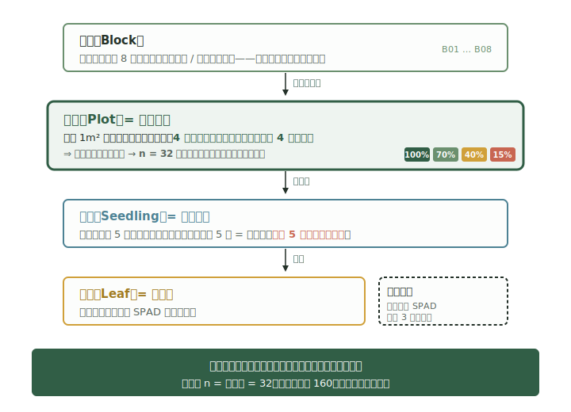

```{=html}
<style>
/* ========================================================
   第 3 章封面：实验设计流水线
   纵向三层：①看见差异（红撕边便签）→ ②排除替代解释（蓝齿轮链）
                                    → ③形成因果证据（绿硬卡片）
   仅本章使用，命名空间限定在 .ch3-fig 之下，正文组件仍用全局 styles.css。
   ======================================================== */
.ch3-fig {
  background: #fff;
  border: 2px solid #1a1a1a;
  border-radius: 16px 6px 16px 6px;
  box-shadow: 5px 5px 0 #1a1a1a;
  padding: 1.6rem 1.4rem 1.4rem;
  margin: 0 0 2.5rem 0;
}
.ch3-fig-h {
  font-family: "Gochi Hand", "Caveat", "楷体", cursive;
  font-size: 1.2rem; font-weight: 700; color: #1a1a1a;
  text-align: center; margin-bottom: 1.2rem;
  letter-spacing: 0.1em;
}

/* 通用阶段容器 */
.ch3-stage {
  display: grid;
  grid-template-columns: 64px 1fr;
  align-items: center;
  gap: 0.9rem;
  margin: 0.4rem 0;
}
.ch3-mascot { width: 56px; height: 56px; }

/* 阶段 ①：红色撕边便签——一份"看起来合理但站不住脚"的方案 */
.ch3-vague {
  background: #ffebee;
  border: 2.5px solid #ef5350;
  border-radius: 4px 18px 6px 16px;
  padding: 0.85rem 1rem 0.95rem;
  box-shadow: 4px 4px 0 #1a1a1a;
  transform: rotate(-1.5deg);
  position: relative;
}
.ch3-vague::before {
  content: "";
  position: absolute; top: -8px; left: 18px;
  width: 30px; height: 14px;
  background: #ffd54f;
  border: 2px solid #1a1a1a;
  border-radius: 2px;
  transform: rotate(-8deg);
  box-shadow: 1px 2px 0 rgba(0,0,0,0.15);
}
.ch3-vague-h {
  font-family: "Gochi Hand", "Caveat", "楷体", cursive;
  font-weight: 700; font-size: 0.95rem; color: #c62828;
  letter-spacing: 0.05em; margin-bottom: 0.35rem;
}
.ch3-vague-q {
  font-family: "楷体", "STKaiti", "Microsoft YaHei", cursive;
  font-size: 0.92rem; color: #333; line-height: 1.65;
}

/* 箭头 */
.ch3-arrow {
  font-family: "Gochi Hand", "Caveat", cursive;
  font-size: 1.8rem; font-weight: 700; color: #1a1a1a;
  text-align: center; line-height: 1.1;
  margin: 0.2rem 0 0.2rem 0;
  transform: rotate(-2deg);
}

/* 阶段 ②：蓝色齿轮链——五个排除替代解释的步骤 */
.ch3-machine {
  background: #e1f5fe;
  border: 2.5px solid #0288d1;
  border-radius: 16px 4px 18px 6px;
  padding: 0.9rem 0.9rem 0.95rem;
  box-shadow: 4px 4px 0 #1a1a1a;
  transform: rotate(0.5deg);
}
.ch3-machine-h {
  font-family: "Gochi Hand", "Caveat", "楷体", cursive;
  font-weight: 700; font-size: 0.95rem; color: #01579b;
  letter-spacing: 0.05em; margin-bottom: 0.5rem; text-align: center;
}
.ch3-gears {
  display: grid;
  grid-template-columns: repeat(5, 1fr) auto;
  gap: 0.35rem;
  align-items: stretch;
}
.ch3-gear {
  background: #fff;
  border: 2px solid #0288d1;
  border-radius: 6px 2px 6px 2px;
  padding: 0.45rem 0.3rem;
  text-align: center;
  font-family: "楷体", "STKaiti", "Microsoft YaHei", cursive;
  font-size: 0.84rem; font-weight: 700; color: #01579b;
  box-shadow: 2px 2px 0 rgba(0,0,0,0.18);
}
.ch3-gear .num {
  display: inline-block;
  background: #0288d1; color: #fff;
  width: 18px; height: 18px; line-height: 18px;
  border-radius: 50%;
  font-size: 0.78rem; margin-right: 0.25rem;
}
.ch3-gear-arrow {
  display: none; /* 在桌面下省略横向箭头，依靠左到右的视觉顺序 */
}

/* 阶段 ③：绿色硬卡片——可被反驳的因果结论 */
.ch3-result {
  background: #e8f5e9;
  border: 2.5px solid #2e7d32;
  border-radius: 6px 16px 4px 18px;
  padding: 0.9rem 1rem;
  box-shadow: 4px 4px 0 #1a1a1a;
  transform: rotate(-0.5deg);
}
.ch3-result-h {
  font-family: "Gochi Hand", "Caveat", "楷体", cursive;
  font-weight: 700; font-size: 0.95rem; color: #1b5e20;
  letter-spacing: 0.05em; margin-bottom: 0.3rem;
}
.ch3-result-claim {
  font-family: "楷体", "STKaiti", "Microsoft YaHei", cursive;
  font-size: 0.95rem; color: #1a1a1a; line-height: 1.65; font-weight: 700;
}
.ch3-result-sub {
  font-family: "Microsoft YaHei", "PingFang SC", system-ui, sans-serif;
  font-size: 0.82rem; color: #2e7d32; margin-top: 0.35rem;
}

/* 底部一行收束 */
.ch3-caveat {
  margin-top: 1.1rem;
  padding: 0.6rem 0.85rem;
  background: #fafafa;
  border-left: 3px solid #1a1a1a;
  border-radius: 2px;
  font-family: "Microsoft YaHei", "PingFang SC", system-ui, sans-serif;
  font-size: 0.86rem; color: #1a1a1a; line-height: 1.7;
}

/* ----- 窄屏（手机） ----- */
@media (max-width: 640px) {
  .ch3-stage {
    grid-template-columns: 48px 1fr;
    gap: 0.6rem;
  }
  .ch3-mascot { width: 44px; height: 44px; }
  .ch3-gears {
    grid-template-columns: repeat(2, 1fr);
  }
  .ch3-vague, .ch3-machine, .ch3-result { transform: none; }
}
</style>

<div class="ch3-fig sketch">
  <div class="ch3-fig-h">从「药后变好」到「药物导致变好」</div>

  <!-- ① 看见差异：一份不能站住脚的方案 -->
  <div class="ch3-stage">
    
    <div class="ch3-vague">
      <div class="ch3-vague-h">① 看见差异</div>
      <div class="ch3-vague-q">「东侧露天 30 盆开花更多，西侧遮阴 30 盆开花更少。<br>是光照的功劳，还是分组本来就不公平？」</div>
    </div>
  </div>

  <div class="ch3-arrow">↓</div>

  <!-- ② 排除替代解释：五道工序 -->
  <div class="ch3-stage">
    
    <div class="ch3-machine">
      <div class="ch3-machine-h">② 排除替代解释（设计的五道工序）</div>
      <div class="ch3-gears">
        <div class="ch3-gear"><span class="num">1</span>实验单位</div>
        <div class="ch3-gear"><span class="num">2</span>对照</div>
        <div class="ch3-gear"><span class="num">3</span>随机化</div>
        <div class="ch3-gear"><span class="num">4</span>区组</div>
        <div class="ch3-gear"><span class="num">5</span>测量</div>
      </div>
    </div>
  </div>

  <div class="ch3-arrow">↓</div>

  <!-- ③ 形成可被反驳的因果证据 -->
  <div class="ch3-stage">
    
    <div class="ch3-result">
      <div class="ch3-result-h">③ 形成可检验的因果证据</div>
      <div class="ch3-result-claim">「光照透过率 ≤ 40% 时，黄黄草开花比例显著下降」</div>
      <div class="ch3-result-sub">— 这句话能被新一轮独立数据反驳，所以它才算证据。</div>
    </div>
  </div>

  <div class="ch3-caveat">
    <b>设计不是数据收集的前奏，而是因果结论能够走多远的边界。</b>
    没有设计，再多的数据、再先进的统计模型，都不能告诉你"是处理导致差异，还是分组本身不公"。
  </div>
</div>
```

## 3.1 从"喷药后变好"到"喷药导致变好"

<div class="chapter-route" aria-label="本章学习路线">
  <div><strong>提出对比</strong><span>问题想问什么</span></div>
  <div><strong>找实验单位</strong><span>n 究竟是多少</span></div>
  <div><strong>安排处理</strong><span>对照与随机化</span></div>
  <div><strong>控制偏差</strong><span>区组与测量</span></div>
  <div><strong>写成方案</strong><span>别人能执行</span></div>
</div>

::: {.learning-goals}
**学完本章后，你能够：**

1. 从研究问题中写出研究对象、处理因素与水平、对照、响应变量和目标总体；
2. 区分实验单位、观测单位、子抽样和技术重复，并据此正确写出样本量；
3. 为具体场景实施简单随机分配或区组内随机分配，并解释随机化防止了什么偏差；
4. 在完全随机设计与随机区组设计之间作出有依据的选择，并识别析因、重复测量、嵌套和裂区结构；
5. 从最小有意义效应、自然变异、显著性水平、统计功效和失访风险说明样本量依据；
6. 写出包含设计、测量、质量控制、伦理与分析接口的一页式实验设计方案。
:::

第 2 章中你为黄黄草指名亚种立了项，写出了"2026 年 10 个固定样地的开花数是否显著低于 2025 年"这样可被反驳的研究问题。但你只能**观察**——记录每年的开花数，等候自然给你答案。如果数字真的下降了，你能说"种群在下降"，却**不能说"是什么导致它下降"**。气温、降水、放牧、林冠郁闭度、地下水位都在同时变化。

这一章把研究升级为**操纵实验**：你主动给不同对象施加不同处理，再比较结果。但黄黄草是濒危物种，野外种群不允许人为施加破坏性处理（这条伦理边界 3.7 节会再讲）。所以保护站把试验搬到合作苗圃——那里有近三年从野外种子人工繁育的同年龄幼苗。

研究问题升级为：**林冠郁闭度增加是否抑制黄黄草幼苗的成活与开花？**

苗圃管理员给你一份初始方案：

> 在苗圃东侧露天区选 30 盆 18 月龄幼苗喷上常规营养液，西侧遮阴棚下选 30 盆同样营养处理。半年后，比较两组的开花株比例。

这份方案哪里出了问题？**先不要往下看，写出至少一种"非光照"解释**，再继续读。

---

苗圃东西两侧不只是光照不同。东侧靠水井——浇水更勤、土壤含水量更高；西侧靠防风林——风速更小、气温更稳；遮阴棚是去年才搭的——西侧的盆是后来才搬进去的，入棚时间和苗龄起点都不同；管理员习惯下午先浇东侧、再浇西侧——浇水时间差也是系统性的。

光照、土壤含水、风速、苗龄起点、浇水时间——**全部和"东侧 / 西侧"这个分组共变**。哪怕你最后看到东侧开花率高 30%，你也无法把这个差异归功于光照。这就是**混杂（confounding）**：当两个或多个因素总是手拉手一起变化时，结论无法把功劳分给其中任何一个。

观察性研究只记录自然暴露——黄黄草年份对比、林缘 vs 林内开花数比较——它**只能描述模式**，不能在两个相关变量之间分清因果。操纵实验的力量在于：研究者主动决定谁接受什么处理。这种主动分配，配上**随机化**，能让组间差异在期望意义上**只剩下处理效应**。

但要注意一句重要的话：**随机化能让因果解释变可能，但不能修复测量偏差、处理污染或严重失访。** 如果调查员中途改了"开花"的判定标准，再好的随机化也救不回来。这条会在 3.6 节再讲。

::: {.observation-question}
**章内检查 3.1：** 假如有人拿着东西两侧那份方案的数据来找你说"光照不影响开花"——结果显示东西两侧没有差异，所以光照无所谓。这个结论是否成立？为什么？
:::

::: {.key-judgment}
**关键判断：** 实验设计不是数据收集的前奏，而是因果结论能够走多远的边界。
:::

## 3.2 实验单位、观测单位与样本量的真正含义

把初始方案改对之前，必须先回答一个看起来无聊但极其重要的问题：**这个实验的 n 是多少？**

很多研究者会脱口而出"30 盆 × 每盆 5 株 = 150"。这是错的。要看清楚错在哪，需要把"研究里的对象"分成四个层级。

**目标总体（target population）：** 你最终想把结论推广到的所有对象。对本研究是"保护区合作苗圃中由 2024 春季野外种子繁育、目前 18 月龄的黄黄草指名亚种幼苗"。注意它**不是**"野外所有黄黄草"——后者是另一个总体，外推时会有损耗（3.7 节再讲）。

**实验单位（experimental unit）：** 处理被独立随机分配到的最小对象。**这一层是写 n 时唯一应该数的。**

**观测单位（observational unit）：** 你实际做测量的对象。它可以和实验单位相同，也可以是实验单位下的细分。

**子抽样（subsampling）：** 同一个实验单位内多个观测单位，用来提高该单位均值的测量精度。

**技术重复（technical replicate）：** 同一生物样本在同一测量流程中的重复读数，用来量化测量误差。

回到主案例。改造后的方案是这样的：

- 苗床被划分为 8 个**区组**（南段近水源 / 北段近防风林——基线含水量本底差异强，这是"区组"的依据，3.4 节再讲）；
- 每个区组里有 4 个 1 m² 的**小区**，每个小区有自己独立的可拉式遮阴帘；
- 4 种光照水平（全光照 100% / 70% / 40% / 15%）在每个区组内**随机分配**到 4 个小区；
- 每个小区里标记 5 株**幼苗**用于跟踪；
- 每株幼苗上选取若干**叶片**做 SPAD 叶绿素读数，每片叶子用仪器**连测 3 次**取均值。

四个层级是这样的：

{fig-alt="实验单位层级图，四层方框依次为区组、小区、幼苗、叶片；箭头标明处理在小区层随机分配，因此小区是实验单位。"}

**处理（光照水平）施加在小区层。** 因此：

- **小区**是实验单位 → **n = 32**（8 区组 × 4 小区）；
- **幼苗**是观测单位（5 株/小区）；
- 同小区内的 5 株幼苗是**子抽样**——它们提高你对"这个小区开花率"的估计精度，但**不提供新的处理重复**：因为它们都接受同一个处理，受同一个遮阴帘下的湿度、温度、风速影响；
- 同一片叶子的 3 次 SPAD 读数才是**技术重复**——它告诉你仪器测得有多稳。

写错 n 的代价是什么？假设小区数 n = 32，但你"算"成了 160（每株一个 n）。这等于把同一小区内的 5 株幼苗当作了 5 个独立处理重复——也就是**伪重复（pseudoreplication）**。后果是统计软件以为你拥有比实际多 5 倍的独立信息，置信区间会被人为缩窄，P 值会被人为夸小，最后得到一个**根本不存在那么强**的"显著"结果。Hurlbert 1984 年那篇至今被反复引用的论文，专门就是骂这件事。

为了不犯这个错，每次写完方案后做**伪重复诊断三问**：

1. **处理是否独立施加？** 如果 5 株幼苗共享一个遮阴帘，处理对它们就不是独立施加的；
2. **单位能否在不影响其他单位的情况下接受不同处理？** 同小区的 5 株不能——给一株换光照，必然影响同小区其他几株；
3. **误差项是否与随机化层级一致？** 你的"组间差异"应该用什么来比？应该用**小区之间**的变异来比，不能用同小区幼苗之间的变异——后者反映的是测量精度，不是处理效应。

三问任何一个答"否"，就是伪重复。

最后两个常被忽视的反例：

**反例一：** 温室里给单株幼苗独立分盆，每盆独立施加不同光照——这时**植株可以是实验单位**。区别在哪？处理直接施加到了"盆"这一级。

**反例二：** 整座温室统一控温，比较两座温室的两种温度——这时**温室才是实验单位**，而不是温室里的 100 盆幼苗。如果你只有 2 座温室，那 n = 2，没有讨价还价的余地。这种设计天然没救——除非你做很多座温室。

::: {.observation-question}
**章内检查 3.2：** 一份方案写道：「研究 3 种育苗基质对发芽率的影响。每种基质准备一个大盘，在每个大盘中均匀撒入 100 粒种子。三周后统计发芽数，n = 300。」 哪里错了？真正的 n 是多少？
:::

::: {.key-judgment}
**关键判断：** 处理在哪一级被独立随机分配，哪一级通常就是实验单位。样本量 n 首先数实验单位，不数测量次数。
:::

## 3.3 处理、对照与随机化

层级理清了，现在来回答另外两个问题：**比什么 vs 比什么**，以及**谁分到哪里**。

### 把处理因素写成可执行的水平

"光照"两个字不是处理，"轻度遮阴 / 中度遮阴"也不是处理。处理必须是**别人拿到方案能立刻照做**的。在本案例中，处理因素是**光照透过率**，4 个水平：

| 水平 | 实施方式 | 标称值 |
|---|---|---:|
| 全光照 | 不加遮阴帘 | ≈ 100% |
| 轻度遮阴 | 单层 30% 标定遮阴网 | 70% |
| 中度遮阴 | 单层 60% 标定遮阴网 | 40% |
| 重度遮阴 | 双层 60% 叠加 | 15% |

光照水平用 LAI-2200 林冠分析仪在每个小区中心实测一次作为校核，原始读数与标称值同时记录。**不能只写"轻度／中度"——别人看不懂"轻度"是 70% 还是 80%。**

### 对照：用来排除什么替代解释？

对照的本质是"如果处理无效，结果应该长什么样"。不同对照排除的替代解释不同：

- **空白／不处理对照**：什么都不做，用来排除"自然变化"。本案例的"全光照"水平就是空白对照——它代表"不施加遮阴"的状态。
- **载体／假处理对照**：施加处理的载体但不施加有效成分，用来排除"是处理动作本身还是有效成分"。本案例没有载体——遮阴网就是处理本身，没有"假遮阴网"这种东西。
- **阳性／标准处理对照**：施加现行最佳处理，用来回答"新处理是否比已有的更好"。本案例不需要，因为还没有"标准遮阴方案"。

预先指定 **40% 光照水平 vs 全光照**为本研究的**主要比较**——因为 40% 对应野外林冠下的典型光环境，是政策推广上最相关的水平。其余水平用于看剂量趋势。事先把"主要比较"写下来，可以避免"测了七个指标，最后只报告最显著的那一个"——这是本科论文里最常见也最致命的错误。

### "控制变量" ≠ 把环境变成相同

中学时教过"控制变量法"：除了我研究的那个变量，其他都保持一致。在野外或半野外研究里，**这做不到**。苗床不同位置的水分、风速、邻近植物本来就不同；调查员不同天来的状态也不同。

实验设计真正能做的是**四件事**：

1. **限制条件**：只用 18 月龄、来自 2024 春季同一种子批次的幼苗，把"苗龄""遗传背景"等变异源排除在研究范围之外；
2. **区组**：把已知的强异质性源（南北苗床段差异）当成研究的一部分，让每个区组内 4 个处理"内部条件接近"（3.4 节）；
3. **随机化**：把所有未知的、没法事先识别的差异，**平均分配**到各处理组（下面就讲）；
4. **测量协变量**：把可能有影响但没法控制的因素（如基线 SPAD、当日气温）记下来，分析时把它们的效应扣掉。

### 随机化：让"未知差异"不再系统站队

先把两件事分清：

- **随机抽样（random sampling）** 关系到**外部效度**——你能把结论推广给谁。本研究的目标总体是"苗圃 18 月龄黄黄草幼苗"——你需要从这个总体里随机抽 32 个小区上的幼苗，结论才能推广到全苗圃。
- **随机分配（random assignment）** 关系到**内部效度**——组间差异是否能归因于处理。哪怕你的样本不是随机抽的（实际上苗圃只有 32 个可用小区，你全用了），随机分配仍然必要——它让 4 种光照水平在期望意义上落在"基线条件相似"的 4 个小区上。

错误的"随机"做法是**真实研究中的高频陷阱**：

- **按编号奇偶分组**：奇数小区给处理，偶数小区给对照——苗床编号往往按建造顺序排，编号本身就携带时间和位置趋势；
- **按到达顺序分组**：先到的 4 株分对照，后到的 4 株分处理——先到的可能更靠近水源；
- **按"看起来差不多"分组**：研究者凭眼力把"看起来健康的"分进对照——这等于让人主观参与了分组；
- **看了基线再"调整"分组**：先量了基线 SPAD，发现两组不平衡，就交换几个小区让它"看起来更平衡"——这破坏了随机化的所有数学基础。

正确做法只有一种：**用一个事先固定的随机种子，让计算机生成分配表，然后照着执行**。

以下代码用于演示如何生成可复现的区组内随机分配表。**已安装 R 的读者可在 RStudio 中执行；其他读者只需阅读代码与下方输出，理解每个区组每种处理恰好出现一次的约束即可，本章不要求你自己跑这段代码。**

```r
set.seed(20260619)

blocks <- sprintf("B%02d", 1:8)              # 苗床被划分为 8 个区组
treatments <- c("全光照", "70%", "40%", "15%")

allocation <- do.call(
  rbind,
  lapply(blocks, function(block_id) {
    data.frame(
      block = block_id,
      plot  = paste0(block_id, "-P", 1:4),    # 每个区组 4 个小区
      treatment = sample(treatments),         # 区组内随机分配
      stringsAsFactors = FALSE
    )
  })
)

with(allocation, table(block, treatment))     # 每格应等于 1
```

预期输出（关键的交叉验证）：

```
     treatment
block 全光照 70%  40%  15%
  B01      1   1    1    1
  B02      1   1    1    1
  ...
  B08      1   1    1    1
```

每个区组里 4 种光照水平各出现 **一次**——这正是随机区组设计的硬约束。**一旦执行，必须保存：随机种子、生成时间、分配表、谁执行的。** 不能"看了基线后觉得不满意又重新抽一遍"——那等于把刚刚的随机化全部作废。

::: {.observation-question}
**章内检查 3.3：** 一位研究者写道：「我先生成了一个随机分配表，但发现 B01 区组里 100% 全光照分到的小区刚好基线 SPAD 偏高，所以我把 B01 的 100% 和 70% 对调了一下，让基线更平衡。」 这个操作破坏了什么？还能不能用最初的统计推断？
:::

::: {.key-judgment}
**关键判断：** 对照排除你想得到的替代解释；随机化排除你想不到的替代解释。两者都是必需的，不能互相替代。
:::

## 3.4 设计类型谱：从 CRD 到识别复杂结构

教材里常见的"实验设计大全"会列六种、八种、十种设计名词，让学生背"哪种设计在哪种情况下用"。这不是好的学法。**真正决定你用哪种设计的，是你研究对象内部的"已知异质性结构"是什么。** 把它当成一棵决策树会清楚得多：

```
你面对的实验材料：
│
├─ 基本同质，没有强而已知的差异梯度 ─────→ 完全随机设计 CRD
│
└─ 存在已知的强差异源（空间、批次、基线）───→ 随机区组设计 RCBD
   │
   ├─ 同时操纵 ≥2 个因素，关心交互作用 ─────→ 析因设计
   │
   ├─ 同一单位在多个时间点被测量 ──────────→ 重复测量
   │
   ├─ 单位天然嵌套于上层（树→样地→林分）──→ 嵌套设计
   │
   └─ 不同因素施加在不同层级 ──────────────→ 裂区设计
```

本章对这六种设计的要求是分等级的：

| 设计 | 本章对你的要求 |
|---|---|
| **完全随机设计（CRD）** | 必须能独立设计、写 n、写分配方法 |
| **随机区组设计（RCBD）** | 必须能独立设计、写区组依据、写分配方法 |
| 析因设计 | 识别结构、知道主效应不能替代交互作用 |
| 重复测量 | 识别结构、知道时间点不是独立重复 |
| 嵌套设计 | 识别结构、找到处理施加在哪一层 |
| 裂区设计 | 识别结构、分别指出主区与子区实验单位 |

复杂设计的**模型计算**留到第 9、12、18 章——本章只要求**你能看出"它是哪种结构"，并知道找谁帮忙**。

### 完全随机设计（CRD）

**适用：** 实验单位基本同质，没有强且已知的空间、批次或基线梯度。

**做法：** 把所有实验单位编号，用计算机给每个单位随机分配一个处理水平。

**完整案例：** 同批次温室幼苗均一分盆，盆与盆之间随机交错摆放，比较 4 种光照水平。每个水平 8 盆，n = 32 盆。

**数据表必须保留：** 实验单位 ID、处理、响应。

**典型失败方式：** 实验单位实际上**不**同质——例如盆位置在温室南北壁附近的实际微气候差异很大——却假装它们同质，结果处理效应被"南北位置效应"掩盖。

### 随机区组设计（RCBD）—— 本章主案例采用的设计

**适用：** 存在一个**强且可提前识别**的差异来源（如苗床南北含水量、林分、批次、基线严重度）。

**核心思想：** 把这个已知的差异当作"区组"先分出来，让每个区组内的单位条件接近。**在区组内**做随机化，使所有处理在每个区组里都出现一次。区组之间的差异从分析中扣除，剩下的才是真正的处理效应。

**做法：** 先按差异源把单位分成 K 个区组（每个区组里有 t 个单位，t = 处理数）；区组内随机分配处理。

**完整案例：** 本章主案例。8 个区组（按苗床南北段含水量本底）× 4 个光照水平 = 32 个小区。区组内随机化的代码与输出见 3.3 节。

**数据表必须保留：** 区组 ID、单位 ID、处理、响应。**没有区组 ID，分析就回不到正确的设计。**

**典型失败方式：** 把"区组因素"忘记记进数据表，事后把数据交给统计员——他没法从一张扁平表里恢复出区组结构，只能按 CRD 处理。结果是区组带来的方差全部进了误差项，处理效应被它淹没。

### CRD 还是 RCBD？三个判断维度

| 维度 | CRD | RCBD |
|---|---|---|
| **已知异质性强度** | 弱或不知道 | 强且可提前识别 |
| **随机化范围** | 全部单位之间 | 每个区组内 |
| **数据表必须的额外字段** | 无 | 区组 ID |
| **分析时必须保留的信息** | 单位 ID、处理 | 单位 ID、处理、**区组 ID** |
| **常见失败方式** | 假装同质，实际有梯度 | 区组事后丢失，无法恢复 |

**警告：区组不是越多越好。** 如果某个"区组因素"和响应变量根本无关，它会白白消耗分析自由度，并让方案执行更复杂——你为了一个不存在的差异源付出了真实成本。一个区组因素值不值得设，要看：(1) 你有没有先验证据它会强烈影响响应；(2) 是否能在试验开始前就识别出来。

### 复杂设计的识别表

下面四种结构本章只要求**看出来**——具体模型计算去后面的章节学。

| 结构 | 识别信号 | 后续接口 |
|---|---|---|
| **析因设计** | 同时操纵两个或更多处理因素，每个有多个水平。例如：光照 × 浇水频率，2×2 = 4 个组合 | 第 9、12 章 |
| **重复测量** | 同一实验单位在多个时间点被测量，例如同一小区在 3 个月、6 个月、12 个月各测一次 | 第 18 章 |
| **嵌套设计** | 单位天然嵌套于上层。例如树嵌套于样地，样地嵌套于林分；处理在最上层施加 | 第 18 章 |
| **裂区设计** | 不同因素施加在不同层级。主因素施加在大区（主区），副因素施加在大区内的小区（子区） | 第 18 章或专业课程 |

学生最容易把**重复测量**当成"额外的 n"。如果同一小区在 3 个月、6 个月、12 个月各测一次，你的小区数仍是 32，**不是** 96。三个时间点的观测之间存在相关，必须用专门的方法（第 18 章）来处理。

<div class="mascot-note">

<div class="mascot-note-copy">
<strong>黑豹提醒：不要数测量次数，要数独立分配次数</strong>
<p>n 这个数字数的是<strong>处理被独立分配过几次</strong>，不是你拿仪器读了几个数。如果 8 个区组里每个区组放 4 个小区，每个小区里 5 株幼苗、每株 3 片叶子、每片叶子 SPAD 仪连读 3 次——你不是有 1440 个独立 n，你只有 <strong>32 个独立 n</strong>（小区数）。其余的乘数全都是为了让"小区均值"测得更准，不是为了多出独立处理重复。</p>
</div>
</div>

::: {.observation-question}
**章内检查 3.4：** 苗床南北段含水量差异强，但有研究者坚持："反正我会用统计模型把含水量当协变量扣掉，所以用 CRD 就行了。" 他的做法是否一定错？什么情况下这个想法可行，什么情况下不可行？
:::

## 3.5 样本量不是"每组通常做 10 个"

学生常问的第一个问题是："那我每组放几个？"教材里常给的答案是"本科实验每组至少 3 个"或"通常每组 10 个"。

**这两个答案都没用。** 它们没考虑你想发现多大的效应、变异有多大、你的功效目标是多少。一个**真实**的样本量论证，由五个输入推出来：

1. **最小有意义效应（minimum meaningful effect）**：多大的差异是值得发现的？比如"开花比例提高 10 个百分点"才有保护意义；如果只能检测到 30 个百分点的差异，那你设计的研究在保护决策上没价值。**这一项必须由你自己根据保护目标决定，统计学帮不了你。**
2. **单位间变异（between-unit variability）**：同一处理下不同实验单位的响应有多分散？需要先导试验或文献给出标准差估计。
3. **显著性水平（α）**：通常 0.05。这是你愿意承受的"假阳性"率。
4. **目标功效（power, 1−β）**：通常 0.8。如果效应真的存在，你有 80% 概率能发现它。
5. **预计损耗（attrition）**：苗子会死、设备会坏、调查员会忘记。预先打折 10–20%。

**两个思想实验**让你看出这五个量怎么互动：

**思想实验 A：变异更大需要更多 n。** 假设两种育苗基质对发芽率的真实差异是 8 个百分点。基质变异小（CV = 5%）时也许 n = 12 就能 80% 功效检测到；变异大（CV = 20%）时也许要 n = 80。**真实效应没变**，但你需要的样本量随变异平方增长。

**思想实验 B：测更多叶片不能替代更多独立小区。** 你测一个小区里 5 株幼苗的开花率与测 50 株的开花率——后者会让"这个小区开花率"的估计更准，但**对比较 32 个小区的处理效应没有帮助**。能让"组间差异"更精确的，只有更多独立小区。

先导试验是必要的，但**不是用来"证明效应存在"的**——它的本职工作是：

- 估计变异（让正式试验能算出该需多少 n）；
- 检查测量流程能不能跑通（设备、调查员、记录表）；
- 暴露执行细节里的坑（遮阴帘会不会被风吹歪、SPAD 仪在阴雨天读数稳不稳）。

**不要**拿先导试验的"效应估计"当稳定真值——先导样本太小，估计的效应是高度不稳定的。把先导效应直接套进正式样本量计算，会严重低估你需要的 n。

本章不要求你算具体的样本量公式——P 值和模型都还没学。但**章末综合任务里你必须写出一段"样本量论证链"**：

> "我希望检测的最小有意义效应是 X；先导试验给出的小区间标准差是 σ ≈ Y；按 α = 0.05、功效 0.8 计算（具体公式留待第 8 章），需要每组 n ≈ Z 个小区；考虑 15% 损耗，最终每组 n = ⌈Z/0.85⌉ 个小区。"

这段话每个数字都必须有来源——不能凭空说"每组 10 个差不多吧"。

::: {.observation-question}
**章内检查 3.5：** 你的先导试验只用了 4 盆，结果显示中度遮阴的开花率比对照高 25 个百分点。能否据此把正式试验的样本量缩到很小（"反正效应这么大，10 盆够了"）？
:::

## 3.6 测量方案与分析接口

设计的最后一道关：**测量是否一致，数据表是否能恢复出设计**。这两件事失败一项，前面所有努力作废。

### 测量协议必须覆盖的清单

- **主要 vs 次要响应、单位、时间点、仪器或分级标准**：本案例主要响应是"6 个月时小区水平的开花成活幼苗占比"；次要响应是"株高增量"、"SPAD 值"——明确标注为次要，结论不能基于次要响应反推；
- **准确性 vs 精密度**：仪器是否校准过（准确性）vs 同一对象重复测的稳定度（精密度）。两者都重要但要分开评估；
- **调查员一致性**：在试验开始前，让所有调查员对同一批样本独立打分，比较一致度（如 Cohen's κ）。一致度低就培训到合格再开始；
- **盲法判读**：判读"开花 / 未开花"的人**不应该知道**那个小区分配的是哪个光照水平。可以在判读阶段把处理标签遮起来；
- **仪器校准**：SPAD 仪每次出场前用标准卡片校准；
- **重复测量比例**：约 10% 的样本用第二位调查员独立复测一次，用来事后核查一致度；
- **异常值与缺失值规则**：什么样的读数算异常？怎么标记缺失？规则**事先**写下来；
- **处理污染、依从性、失访的记录**：遮阴帘被风吹翻了？记下来；某个小区的幼苗大半死光了？记下来。**绝不能**事后偷偷把"不听话"的小区从分析里删掉——这是篡改数据。

### 设计 — 数据表 — 分析的映射

设计决定了数据表中每一行代表什么；数据表的字段决定了分析能干什么。下表把这条链显式写出来：

| 设计信息 | 数据表必须保留的字段 | 分析后果 |
|---|---|---|
| CRD、单因素 | 实验单位 ID、处理、响应 | 两组比较或单因素 ANOVA（第 8、9 章） |
| RCBD | **区组 ID**、单位 ID、处理、响应 | 必须控制区组（第 9 章） |
| 同一单位重复测量 | 单位 ID、**时间**、处理、响应 | 观测不独立，不能做普通独立样本检验（第 18 章） |
| 小区内多株幼苗 | **小区 ID**、幼苗 ID、处理、响应 | 重复数按小区计算，必要时层级模型（第 18 章） |
| 两因素析因 | 两个因素及水平、响应 | 必须考虑交互作用（第 9、12 章） |

注意每一行**加粗的字段**——一旦丢了，整行设计就回不来了。RCBD 丢了区组 ID，分析里区组方差全部进误差项；重复测量丢了时间，统计软件会以为这是独立样本；嵌套设计丢了小区 ID，5 株幼苗会被当成 5 个独立小区。

::: {.key-judgment}
**关键判断：** 统计软件不能从一张丢失了区组 ID、单位 ID、时间 ID 的"扁平表"中恢复实验设计。
:::

<div class="mascot-note">

<div class="mascot-note-copy">
<strong>黑豹提醒：随机化不能拯救含糊的测量</strong>
<p>如果"开花"的判定标准在试验中途被换过，或者主要响应的时间点事后改了，或者"哪个小区算无效"的排除规则在结果出来后才补上——再完美的随机化也救不回来。<strong>所有判定与排除规则必须在见到结果之前写下来并冻结。</strong></p>
</div>
</div>

::: {.observation-question}
**章内检查 3.6：** 调查员小张在试验第 4 个月时，发现自己之前一直把"花蕾刚露白"算"未开花"，但学过保护学的小李说应该算"开花"。两人讨论后决定从此把"花蕾露白"统一算开花，并把前 3 个月的数据按新标准回填。这个操作有什么问题？
:::

## 3.7 一页式方案、伦理边界与执行

**到这里，所有零件都齐了。**最后一步是把它们装进一个**别人看了能照做**的方案里。本节给你一个 12 字段模板。综合练习要求你为本章主案例填出完整的一份；之后你也将用同一模板批判另一份方案。

### 12 字段一页式模板

| # | 字段 | 内容要求 |
|--:|---|---|
| 1 | **研究问题与可证伪假设** | 一句研究问题 + 一对（H₀, H₁），假设必须能被新数据反驳 |
| 2 | **目标总体、纳入与排除标准** | 结论要外推到谁；哪些个体进入研究、哪些排除（含"为什么排除"） |
| 3 | **实验单位、观测单位与层级关系** | 显式画出层级图；写明"处理施加在哪一层" |
| 4 | **处理因素、水平、施加方式与对照** | 每个水平如何执行；对照排除什么替代解释 |
| 5 | **随机化方法、随机种子、分配记录** | 用什么方法随机化；种子值；何时执行；谁执行 |
| 6 | **区组或其他限制随机化及其理由** | 区组依据是什么；为什么这是已知强差异源 |
| 7 | **独立重复数、子抽样数与样本量依据** | n（实验单位）+ 子抽样数；从最小有意义效应、变异、α、功效、损耗推出 n 的论证链 |
| 8 | **主要 / 次要响应、测量时间与质量控制** | 主要响应**事先**指定；调查员培训、盲法、校准、重测比例 |
| 9 | **缺失、污染、退出与不良事件记录规则** | 异常值定义、缺失编码、污染如何记录（**不能事后删除**） |
| 10 | **数据表必须保留的 ID 与分析接口** | 列出每一行包含哪些 ID 字段；指向后续哪一章的分析方法 |
| 11 | **伦理、生态安全、人员与时间可行性** | 涉及哪些伦理边界；为何这个方案能被实际执行 |
| 12 | **预先规定的主要比较与结论边界** | 哪个比较是主要的、哪些是次要的；结论可外推到什么、不可外推到什么 |

### 主案例的压缩示范

下面把主案例填进 12 字段（**样本量数字标注为待先导数据填入，本章不编造固定 n**）：

| # | 黄黄草苗圃光照梯度试验 |
|---|---|
| 1 | 林冠郁闭度（光照透过率）是否抑制黄黄草指名亚种 18 月龄幼苗的开花成活率？H₀：4 个光照水平下 6 个月时小区开花比例无差异。H₁：开花比例随光照水平递减。 |
| 2 | 目标总体：保护区合作苗圃 2024 春季野外种子繁育的同年龄幼苗。纳入：18 月龄、目测无明显病害。排除：基线 SPAD < 25（健康度过低）。 |
| 3 | 区组（苗床段） → 小区（1 m² 独立遮阴）→ 幼苗（每小区 5 株标记）→ 叶片（SPAD 读数）。处理施加于小区层。 |
| 4 | 处理因素：光照透过率，4 水平（100% / 70% / 40% / 15%）。100% 全光照为空白对照；40% 对应野外林冠下典型光环境，预先指定为主要比较。 |
| 5 | R 区组内随机化，种子 20260619（见 3.3 节代码），分配表执行前打印归档。 |
| 6 | 区组依据：苗床南北段含水量本底差异强（南近水源 / 北近防风林），先导测量证实平均含水量差 ≥ 5%。 |
| 7 | n = ⌈待定／0.85⌉ 个小区。**论证链待先导试验提供小区间标准差 σ 估计、最小有意义效应取 10 个百分点开花比例后，按 α = 0.05、功效 0.8 计算 → 第 8 章详述。** 每小区子抽样 5 株幼苗、每株 3 片叶子。 |
| 8 | 主要响应：6 个月时小区水平开花成活幼苗占比；次要响应：株高增量、SPAD。盲法判读：判读员遮蔽处理标签。SPAD 仪每次校准。10% 重测一致度复核。 |
| 9 | 异常值：SPAD 单读数偏离同叶 3 次均值 > 2σ → 标记，不删除。缺失编码 NA。处理污染（遮阴帘破损）单独字段记录，不删除。 |
| 10 | 数据表字段：`block_id, plot_id, treatment, seedling_id, leaf_id, time, spad, flowered, baseline_spad, attrition_flag`。分析接口：第 9 章 RCBD ANOVA + 第 18 章层级模型对子抽样建模。 |
| 11 | 伦理：使用人工繁育苗，不在野外施加破坏性处理。可行性：苗圃合作协议覆盖 12 个月，调查员 2 人轮值。 |
| 12 | 主要比较：40% vs 100%。次要：70% vs 100%、15% vs 100%、剂量趋势。**外推边界：结论适用于苗圃 18 月龄幼苗；外推到野外成体植株时，外部效度有损耗（土壤微生物群落、自然竞争、物候时序均不同），需在讨论中明示。** |

### 伦理与外推边界

濒危物种实验有两条**不可让渡**的原则：

- **不在野外个体上施加破坏性处理。**人工繁育苗、模拟环境、半野外样地是替代方案。
- **苗圃 → 野外的外推必然有损耗。**苗圃幼苗的根际微生物、邻近植被、土壤结构、物候节奏都和野外不同。哪怕苗圃实验给出"中度遮阴最有利于开花"的清晰结论，**也不能据此直接建议保护区在野外大面积"人工增加遮阴"**——这中间还需要至少一轮野外验证（哪怕只是观察性的、跨多个自然郁闭度梯度的样地比较）。

第 12 字段"结论边界"就是为了让这件事写在方案里、被读者看见，而不是含糊掉。

::: {.observation-question}
**章内检查 3.7：** 你的同学完成了主案例方案，结果显示 40% 光照下开花率最高，比 100% 高 14 个百分点。他的论文结论写："建议保护区在所有黄黄草分布点人工搭建遮阴网，以保证种群延续。" 这个建议跨过了什么边界？应该改成什么样？
:::

## 本章小结

- **设计决定结论能走多远。** 没有设计的数据再多也不能告诉你"是处理导致差异"还是"分组本来不公平"。
- **n 数的是实验单位，不是测量次数。** 处理在哪一级被独立随机分配，哪一级就是实验单位；同一单位内的多株、多片叶、多次读数都是子抽样或技术重复。
- **对照排除你想得到的替代解释；随机化排除你想不到的替代解释。** 两者都是必需的，不能互相替代。
- **CRD 还是 RCBD，由你研究对象内部的"已知异质性"决定，不是背定义决定的。** 异质性强且可提前识别 → RCBD；否则 → CRD。区组不是越多越好。
- **样本量论证必须有链条：** 最小有意义效应 → 变异 → α/功效 → 损耗。"每组 10 个"不是论证。
- **数据表必须能恢复出设计。** 区组 ID、单位 ID、时间 ID 一旦丢失，再聪明的统计软件也救不回来。
- **濒危物种的实验必须搬离野外个体。** 苗圃 / 模拟 / 半野外是合法路径，但外推必有损耗，必须写进结论边界。

## 练习

1. **识别层。** 在以下四个场景中标出实验单位、观测单位、子抽样和技术重复，并写出 n：
   (a) 一座温室控温 28°C，另一座控温 22°C，每座放 100 盆幼苗；
   (b) 苗圃中 8 块独立可遮阴的 1 m² 小区，4 种光照水平随机分配，每小区 5 株幼苗；
   (c) 同一片实验林中标记 30 棵松树，按编号奇偶分给两种生物农药，每棵树测 5 根枝条；
   (d) 24 个独立培养皿，3 种营养液随机分配（每液 8 皿），每皿数 3 次菌落数。

2. **解释层。** 用一两句话分别说明：随机化、重复、区组三者各自控制了哪一种不确定性？为什么三个不能互相替代？

3. **应用层。** 为"三种育苗基质对黄黄草发芽率的影响"设计一个 CRD 方案。写出：实验单位、随机分配方法（含种子）、独立重复数、主要响应。

4. **分析层。** 批判这份方案的结论边界："一座温室控温 28°C、另一座控温 22°C，每座放 100 盆幼苗。半年后温度高的温室开花率高，结论：高温有利于黄黄草开花。" 给出至少三条致命缺陷。

5. **综合层（用本章主案例）。** 用 12 字段一页式模板完成黄黄草苗圃光照梯度试验的完整方案。样本量字段允许写"待 σ 由先导试验估计"，但必须写出完整论证链。

6. **迁移层。** 把主案例改写为"光照透过率（2 水平：70% / 15%）× 浇水频率（2 水平：每周 1 次 / 每周 3 次）"的两因素析因结构。**只**画出设计结构、写出 4 个组合、指出应该关心交互作用而不只是主效应——**不要**计算具体模型。

7. **AI 核查。** 把练习 5 的方案交给一个大语言模型，要求它指出"方案中所有的设计漏洞"。然后用本章框架（实验单位 / 随机化层级 / 结论边界）逐条标注它的指摘是"接受 / 拒绝 / 证据不足"。它指出的漏洞是真问题，还是它没读懂层级结构？

### 综合方案评分量规（满分 100）

学生完成练习 5 后，可用此量规自评、互评或交给老师评分：

| 维度 | 分值 | 满分标准 | 一票否决式错误（该维度不超过一半分） |
|---|---:|---|---|
| 问题与因果对比 | 10 | 研究问题、H₀/H₁、主要比较三者一致 | 处理与结论不对应 |
| 单位与层级 | 20 | 正确区分实验单位 / 观测单位 / 子抽样 / 技术重复 | 把子抽样当独立处理重复 |
| 处理与对照 | 10 | 各水平可执行；对照能排除关键替代解释 | 没有可解释的对照 |
| 随机化与区组 | 15 | 分配过程可复现；区组依据有先验证据 | 按地点 / 顺序 / 研究者偏好系统分组 |
| 重复与样本量 | 15 | n 数的是实验单位；论证链完整 | 用测量次数冒充独立 n |
| 测量与偏差控制 | 15 | 主要响应预先指定；盲法、校准、重测一致度都有 | 结果出来后才选主要指标 |
| 数据与分析接口 | 10 | 数据表的 ID、层级、时间字段可恢复全部设计信息 | 数据表无法恢复随机化结构 |
| 伦理与可行性 | 5 | 伦理边界写明；外推损耗写明；执行可行 | 方案实际无法执行或风险不可接受 |

## 继续学习

→ [第 4 章：数据管理](04-data-management.qmd)：本章告诉你"数据表中一行该代表什么"——是一个小区、一棵树，还是一片叶子。第 4 章接着告诉你这张表如何**真的被记录、编码、保存、版本化**，让你 6 个月后回头看时不会发现"区组 ID 那一列我当时没记"。
