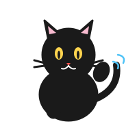

```{=html}
<style>
.cover-v2 {
  background: #ffffff;
  padding: 2.5rem 1.5rem 2rem;
  border-radius: 12px;
  border: 2px solid #1a1a1a;
  box-shadow: 6px 6px 0 #1a1a1a;
  margin: -1rem -1rem 2rem -1rem;
  position: relative;
}
.cover-v2 .cv2-titlewrap { text-align: center; }
.cover-v2 h1.cv2-title {
  font-family: "Gochi Hand", "Caveat", "楷体", "STKaiti", cursive;
  font-size: clamp(2.4rem, 6vw, 4rem);
  font-weight: 800; color: #1a1a1a;
  margin: 0; letter-spacing: 0.06em;
  transform: rotate(-1.5deg);
  display: inline-block;
}
.cover-v2 .cv2-sub {
  font-family: "Gochi Hand", "Caveat", "楷体", cursive;
  color: #555; font-size: 1.35rem; margin: 0.6rem 0 0.2rem;
  font-weight: 700; letter-spacing: 0.05em;
}
.cover-v2 .cv2-author { color: #888; font-size: 0.9rem; }
.cover-v2 .cv2-mascot-row {
  display: flex; align-items: center; justify-content: center;
  gap: 1rem; margin: 1.4rem 0 0.8rem;
}
.cover-v2 .cv2-bubble {
  background: #fffde7; border: 2.5px solid #1a1a1a;
  border-radius: 22px 22px 22px 4px;
  padding: 0.9rem 1.2rem; max-width: 260px;
  font-family: "Gochi Hand", "Caveat", "楷体", cursive;
  font-size: 1.25rem; font-weight: 700; color: #1a1a1a;
  box-shadow: 3px 3px 0 #1a1a1a;
  line-height: 1.55; letter-spacing: 0.04em;
  transform: rotate(1.5deg);
}
.cover-v2 .cv2-mascot {
  width: 140px; height: 140px; flex-shrink: 0;
}
.cover-v2 .cv2-notes {
  display: grid;
  grid-template-columns: repeat(auto-fit, minmax(155px, 1fr));
  gap: 0.9rem; margin: 1.5rem auto 1rem; max-width: 820px;
}
.cover-v2 .cv2-note {
  background: #fff; border: 2.5px solid #1a1a1a;
  border-radius: 16px 6px 18px 4px;
  padding: 0.8rem 0.9rem; box-shadow: 4px 4px 0 #1a1a1a;
  font-size: 0.9rem; color: #1a1a1a;
}
.cover-v2 .cv2-note.t1 { transform: rotate(-2.5deg); background: #ffebee; border-color: #ef5350; }
.cover-v2 .cv2-note.t2 { transform: rotate(2deg);    background: #e1f5fe; border-color: #4fc3f7; }
.cover-v2 .cv2-note.t3 { transform: rotate(-1.5deg); background: #fff8e1; border-color: #ffb300; }
.cover-v2 .cv2-note.t4 { transform: rotate(2.5deg);  background: #f3e5f5; border-color: #ba68c8; }
.cover-v2 .cv2-note.t5 { transform: rotate(-2deg);   background: #e8f5e9; border-color: #66bb6a; }
.cover-v2 .cv2-note .cv2-h {
  font-family: "Gochi Hand", "Caveat", "楷体", cursive;
  font-weight: 800; font-size: 1.2rem; margin-bottom: 0.4rem;
  letter-spacing: 0.04em;
}
.cover-v2 .cv2-note ul { margin: 0; padding-left: 1.2rem; line-height: 1.6; }
.cover-v2 .cv2-note li { font-size: 0.85rem; margin: 0.15rem 0;
  font-family: "楷体", "STKaiti", cursive; }
.cover-v2 .cv2-cta { text-align: center; margin-top: 1.4rem; }
.cover-v2 .cv2-btn {
  display: inline-block; background: #1a1a1a; color: #fff;
  padding: 0.8rem 2rem; border-radius: 30px 8px 30px 8px;
  font-family: "Gochi Hand", "Caveat", cursive;
  font-size: 1.5rem; font-weight: 700;
  text-decoration: none;
  box-shadow: 4px 4px 0 #1a1a1a;
  letter-spacing: 0.05em;
  transform: rotate(-1deg);
}
.cover-v2 .cv2-btn:hover { transform: rotate(-1deg) translate(-2px, -2px);
  box-shadow: 6px 6px 0 #1a1a1a; color: #fff; }
.cover-v2 .cv2-tags {
  text-align: center; color: #888; font-size: 0.7rem;
  font-family: "Caveat", cursive; margin-top: 1rem;
}
@media (max-width: 600px) {
  .cover-v2 .cv2-mascot-row { flex-direction: column; }
  .cover-v2 .cv2-mascot { width: 110px; height: 110px; }
}
</style>

<div class="cover-v2 sketch">
  <div class="cv2-titlewrap">
    <h1 class="cv2-title">从样地到结论</h1>
    <div class="cv2-sub">保护生物学数据实战 · 基于 R 语言</div>
    <div class="cv2-author">管振华 · 2026</div>
  </div>

  <div class="cv2-mascot-row">
    
    <div class="cv2-bubble">
      喵～我是黑豹，<br>
      接下来 22 章的统计冒险，<br>
      我陪你一起走。
    </div>
  </div>

  <div class="cv2-notes">
    <div class="cv2-note t1">
      <div class="cv2-h">第一篇 · 进入统计</div>
      <ul>
        <li>研究问题</li>
        <li>变量类型</li>
        <li>实验设计</li>
      </ul>
    </div>
    <div class="cv2-note t2">
      <div class="cv2-h">第二篇 · 看懂数据</div>
      <ul>
        <li>数据管理</li>
        <li>描述统计</li>
        <li>可视化</li>
      </ul>
    </div>
    <div class="cv2-note t3">
      <div class="cv2-h">第三篇 · 回答问题</div>
      <ul>
        <li>t 检验 / ANOVA</li>
        <li>卡方检验</li>
        <li>相关 / 回归 / GLM</li>
      </ul>
    </div>
    <div class="cv2-note t4">
      <div class="cv2-h">第四篇 · 专业应用</div>
      <ul>
        <li>森林 / 野生动物</li>
        <li>生物多样性</li>
        <li>措施评估</li>
      </ul>
    </div>
    <div class="cv2-note t5">
      <div class="cv2-h">第五篇 · 现代生态统计</div>
      <ul>
        <li>混合模型</li>
        <li>贝叶斯</li>
        <li>时空 / AI 学习</li>
      </ul>
    </div>
  </div>

  <div class="cv2-cta">
    <a href="chapters/01-role-of-statistics.html" class="cv2-btn">开始第 1 章 →</a>
  </div>

  <div class="cv2-tags">
    野生动物 · 森林 · 植物保护 · 林学 · 生物多样性
  </div>
</div>
```


## 欢迎

本书是一本面向野生动物保护、森林保护、植物保护、林学与生物多样性专业学生的案例驱动统计教材。

### 这本书是什么

- **保护问题先行**：每章从一个真实的保护生物学问题出发
- **统计判断为核心**：重点不是背公式，而是"这个问题该用什么方法"
- **R 语言实操**：所有分析代码可运行、可复现
- **AI 辅助但不依赖**：教你用 AI 帮忙，同时教你检查 AI 的对错

### 如何使用

- **学生**：按章节顺序阅读，完成每章练习和 AI 核查任务
- **教师**：根据课时需求选取章节，每个案例可独立教学
- **保护工作者**：按专业方向或问题类型查找所需方法
